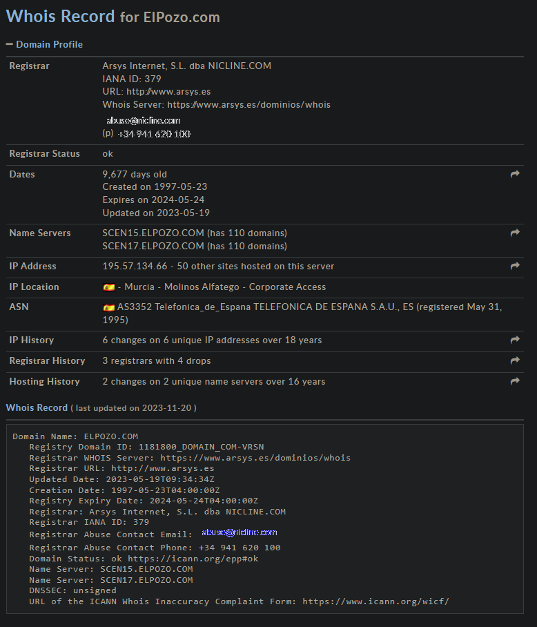
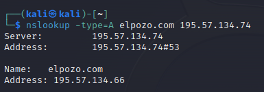

# Mapa DNS El Pozo

En este proyecto, se va a realizar una investigación pasiva sobre la empresa "El Pozo", del cual se va a sacar información sobre proveedores de servicios, direcciones IP, correos electrónicos y demás para así conseguir una auditoría eficiente y elaborada. Se utilizarán herramientas de la línea de comandos de linux, e incluso páginas como DNSDumspter y Shodan.io.

### 1. Whois

Como primera herramienta, utilizaremos Whois. Antes de todo vamos a buscar la página principal de nuestro objetivo, para ello se ha buscado en Google:
www.elpozo.com 

Una vez conocido el objetivo, en mi máquina de ataque, he probado a hacer whois desde la línea de comandos, lo cual no da casi resultado, pero por suerte hay aplicaciones web con la misma función que esta. Para ello se ha utilizado whois.domaintools.com, el cual sí que da información útil.

Desde esta captura podemos apreciar la fecha de cuando se creo, 23-05-1997, el Registrar de este es Arsys Internet, y por lo visto los name servers están creados en el mismo dominio de "elpozo.com". También tenemos que la localización del dominio se encuentra en Murcia, asistido por telefónica.

### nslookup

Ahora se va a realizar un nslookup a nuestro objetivo, con parámetros precisos para sacar la IP del DNS:

Se ha conseguido el servidor de correo utilizado, el cual es Outlook en su mayor medida:

### DNSDumpster

Gracias la herramienta web DNSDumpster, he conseguido obtener hosts de DNS en dos ubicaciones diferentes, España e Irlanda, con esta información:

España:
	 195.57.134.76  scen17.elpozo.com
	 195.57.134.74  scen15.elpozo.com

Irlanda: 
	elpozo-com.mail.protection.outlook.com.  52.101.68.3

Cabe recalcar que el host DNS encontrado en Irlanda es el de Microsoft del cual se obtiene el servicio de correo establecido por El Pozo para la empresa entera.
A raíz de nuestra herramienta también se han adquirido los subdominios no ocultos, los cuales en algunos se puede encontrar la tecnología que se ha utilizado para que este funcione (ejemplo: Wordpress, nginx):

- bienstar2.elpozo.com
- promo1954.elpozo.com
- china.elpozo.com
- ac.elpozo.com
- mail.elpozo.com
- seleccion.elpozo.com
- correo.elpozo.com
- promo.elpozo.com
- bienstar.elpozo.com
- promobienstar.elpozo.com
- agentes.elpozo.com
- empanados.elpozo.com
- calledemisabuelos.elpozo.com
- srv.elpozo.com

![4][img/4.png]

Esta captura contiene el Mapeo DNS de todo el dominio y sus uniones.

### Spiderfoot

Ahora con la herramienta Spiderfoot en kali se puede realizar un escaneo de la página para obtener correos de los empleados, y como resultado, conseguir los nombres y más información sobre ellos. Creo que obtener información de los trabajadores puede servirnos de gran ayuda en un caso de ingeniería social a través de phishing por correo, es por ello que cualquier tipo de utilidad añadida sobre nuestro objetivo conseguirá funcionalidad a la hora de atacar. He aquí 10 correos de ejemplo obtenidos a través del sondeo:

ana.marin@elpozo.com
antonio.avellaneda@elpozo.com
antonio.hernandez@elpozo.com
augusto.fuertes@elpozo.com
blas.serrano@elpozo.com
blasernesto.martinez@elpozo.com
carlos.iniesta@elpozo.com
cayo.ferron@elpozo.com
chema.velasco@elpozo.com
damiam.mesa@elpozo.com

### Wappalyzer 

Por útimo, con la extensión de mi navegador Microsoft Edge, llamada Wappalyzer, podemos conseguir las tecnologías utilizadas por el dominio principal de El Pozo; esta es la información importante obtenida, en caso de si quisieramos encontrar vulnerabilidades de tipo XSS (Cross-site scripting):

- Gestor de Contenido: Wordpress
- Base de Datos: MySQL
- Librerías JavaScript: ScrollMagic, Lightbox, core-js, Mordernizr, jQuery
- Plugins Wordpress: SiteOrigin Widgets Bundle, SiteOrigin Page Builder, Contact Form 7, WPML.
- Servidor Web: NGINX
- Lenguaje de programación: PHP
