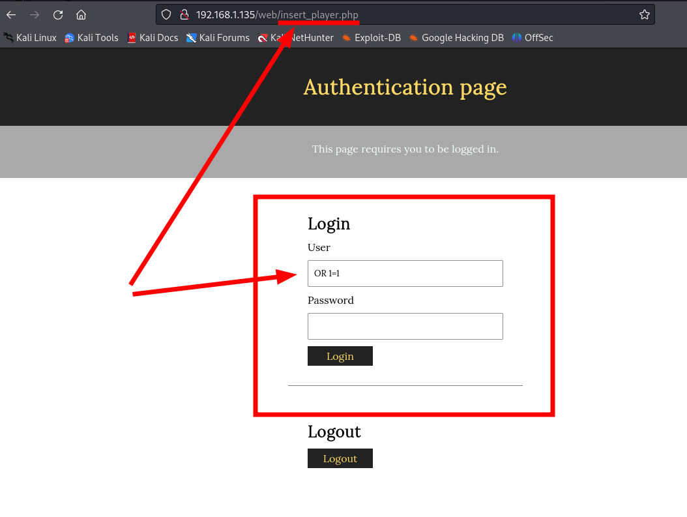
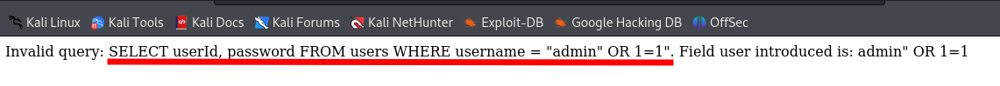
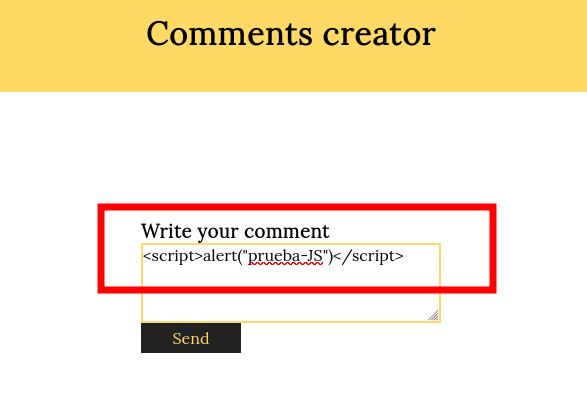
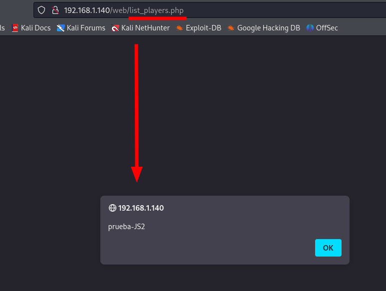

# Informe de Pentesting Web (P8 Web Talent ScouTech)

## Índice
1. [Tratamiento del documento](https://github.com/davidvila21/hackingetico/edit/main/P8%20Web%20Talent%20ScoutTech/Informe%20pentesting.md#tratamiento-del-documento)
   - [Información del documento](https://github.com/davidvila21/hackingetico/edit/main/P8%20Web%20Talent%20ScoutTech/Informe%20pentesting.md#informaci%C3%B3n-del-documento)
2. [Información de Contacto](https://github.com/davidvila21/hackingetico/edit/main/P8%20Web%20Talent%20ScoutTech/Informe%20pentesting.md#informaci%C3%B3n-de-contacto)
3. [Resumen ejecutivo](https://github.com/davidvila21/hackingetico/edit/main/P8%20Web%20Talent%20ScoutTech/Informe%20pentesting.md#resumen-ejecutivo)
   1. [Ámbito y alcance](https://github.com/davidvila21/hackingetico/edit/main/P8%20Web%20Talent%20ScoutTech/Informe%20pentesting.md#%C3%A1mbito-y-alcance)
   2. [Tabla de riesgos](https://github.com/davidvila21/hackingetico/edit/main/P8%20Web%20Talent%20ScoutTech/Informe%20pentesting.md#tabla-de-riesgos)
   3. [Breve resumen](https://github.com/davidvila21/hackingetico/edit/main/P8%20Web%20Talent%20ScoutTech/Informe%20pentesting.md#breve-resumen)
5. [Vulnerabilidades destacadas](https://github.com/davidvila21/hackingetico/edit/main/P8%20Web%20Talent%20ScoutTech/Informe%20pentesting.md#vulnerabilidades-destacadas)
   1. [Conclusiones](https://github.com/davidvila21/hackingetico/edit/main/P8%20Web%20Talent%20ScoutTech/Informe%20pentesting.md#conclusiones)
6. [Metodología utilizada](https://github.com/davidvila21/hackingetico/edit/main/P8%20Web%20Talent%20ScoutTech/Informe%20pentesting.md#metodolog%C3%ADa-utilizada)
7. [Referencia de informe](https://github.com/davidvila21/hackingetico/edit/main/P8%20Web%20Talent%20ScoutTech/Informe%20pentesting.md#referencia-de-informe)

## Tratamiento del documento

### Información del documento

Este documento contiene información de carácter privado y su divulgación fuera de ACME está estrictamente prohibida. 

<table>
    <tr>
        <th colspan="2" style="text-align:center">Control del documento</th>
    </tr>
    <tr>
        <td>Clasificación</td>
        <td>Confidencial</td>
    </tr>
    <tr>
        <td>Cliente</td>
        <td>ACME</td>
    </tr>
    <tr>
        <td>Referencia</td>
        <td>P8-0001-DVD</td>
    </tr>
    <tr>
        <td>Documento</td>
        <td>Evaluación de Infraestructura Web Externa</td>
    </tr>
    <tr>
        <td>Autor</td>
        <td>David Vila Díaz</td>
    </tr>
</table>

<table>
    <tr>
        <th colspan="3" style="text-align:center">Personal autorizado</th>
    </tr>
    <tr>
        <th>Nombre</th>
        <th>Posición</th>
        <th>Compañía</th>
    </tr>
    <tr>
        <td>Francisco Javier Rubio</td>
        <td>Director General</td>
        <td>ACME</td>
    </tr>
    <tr>
        <td>David Vila Díaz</td>
        <td>Pentester</td>
        <td>AUDITBRAND</td>
    </tr>
    <tr>
        <td>Ana Jiménez</td>
        <td>Responsable tecnología</td>
        <td>ACME</td>
    </tr>
</table>

## Información de Contacto

<table>
    <tr>
        <th colspan="4" style="text-align:center">INFO. CONTACTO</th>
    </tr>
    <tr>
        <td>ACME</td>
        <td>Francisco Javier Rubio González</td>
        <td>Director General</td>
        <td>+34-965838282</td>
    </tr>
    <tr>
        <td>ACME</td>
        <td>Ana Jiménez Mateo</td>
        <td>Responsable tecnología</td>
        <td>+34-635353545</td>
    </tr>
    <tr>
        <td>AUDITBRAND</td>
        <td>David Vila Díaz</td>
        <td>Pentester</td>
        <td>+34-687878909</td>
    </tr>
</table>

## Resumen Ejecutivo

Durante el proyecto de inspección de la infraestructura externa llevado a cabo para ACME, AUTDITBRAND ha identificado varios casos.

### Ámbito y alcance

- El pentesting se realizará en el entorno web de "ACME", que es la empresa que solicita la auditoría. 
- Se evaluarán todos los aspectos de seguridad relacionados con los activos web de "ACME", incluyendo su sitio web principal, cualquier aplicación web asociada y otros recursos en línea relevantes.
- La auditoría se centrará en identificar y evaluar posibles vulnerabilidades y debilidades de seguridad en el entorno web de "ACME".
- Se examinarán aspectos como la autenticación y autorización, la gestión de sesiones, la seguridad de los datos, la protección contra ataques comunes (por ejemplo, inyección SQL, XSS, CSRF), la configuración del servidor web y otras áreas críticas de la seguridad web.
- Se incluirá una evaluación de la gestión de usuarios y roles, así como la seguridad de los datos confidenciales manejados por las aplicaciones web de "ACME".

### Tabla de Riesgos

| Riesgo | CVSSv3 | Descripción |
|--------|--------|-------------|
| Crítico | 10 | Se describe una vulnerabilidad que ha sido calificada como crítica y requiere resolución tan rápida como sea posible. |
| Alto | 7 - 9.9 | Se describe una vulnerabilidad que ha sido calificada como alta y requiere resolución a corto plazo. |
| Medio | 4 - 6.9 | Se describe una vulnerabilidad que ha sido calificada como media y debe resolverse como parte del mantenimiento de seguridad de un sistema. |
| Bajo | 1 – 3.9 | Se describe una vulnerabilidad que ha sido calificada como baja y debe ser abordada como parte de las tareas de mantenimiento rutinario. |
| Informativo | 0 – 0.9 | Se realizó un descubrimiento de carácter informal y debe ser abordado con el fin de cumplir con una buena práctica de seguridad. |

### Breve Resumen

A lo largo de esta auditoría, se han encontrado dos vulnerabilidades críticas, una alta y una media. Esto quiere decir que el impacto puede ser muy desastroso en un futuro, afectando de gran manera a la empresa y poniendo en riesgo los datos y la seguridad de estos.

| Fase | Descripción | Crítico | Alto | Medio | Bajo | Info | Total |
|--|--|--|--|--|--|--|--|
| Auditoría de Aplicación Web Talent ScoutTech | 2 | 1 | 1 |  |  |  |  |

## Vulnerabilidades Destacadas

| Descripción de la vulnerabilidad | Inyección SQL permitida en el formulario de inicio de sesión. |
|----------------------------------|--------------------------------------------------------------|
| CVE/CWE                          |        [CWE-89](https://cwe.mitre.org/data/definitions/89.html)                                                    |
| CVSS v3                          |          9.8         |
| Severidad                        |                       Crítico |
| Impacto                          | Un atacante potencial puede acceder a la base de datos alterando la entrada de usuario con una secuencia SQL   |
| POC (Prueba de Concepto)         |         |
| Remediación                      |           Utilizar consultas preparadas y validación de entradas de usuario.                                              |
| Link de referencia              |    [https://owasp.org/www-community/attacks/SQL_Injection](https://owasp.org/www-community/attacks/SQL_Injection)                                                        |

| Descripción de la vulnerabilidad | Information Disclosure - Vulenrabilidad que permite a un atacante acceder a información, archivos y directorios privados o sensibles.  |
|----------------------------------|--------------------------------------------------------------|
| CVE/CWE                          |        [CWE-200](https://cwe.mitre.org/data/definitions/200.html)                                                    |
| CVSS v3                          |          6.0         |
| Severidad                        |                       Medio |
| Impacto                          | Un atacante puede obtener información directa de la base de datos a través de prueba y error en el formulario de inicio de sesión.   |
| POC (Prueba de Concepto)         |         |
| Remediación                      |  Desactivar la depuración en directo de la información de la base de datos, crear consultas preparadas y validación de entradas de usuario.                    |
| Link de referencia              |    [https://owasp.org/www-project-top-ten/2017/A3_2017-Sensitive_Data_Exposure](https://owasp.org/www-project-top-ten/2017/A3_2017-Sensitive_Data_Exposure) |

| Descripción de la vulnerabilidad | XSS - Vulnerabilidad Cross Site Scripting en la página de comentarios |
|----------------------------------|--------------------------------------------------------------|
| CVE/CWE                          |        [CWE-79](https://cwe.mitre.org/data/definitions/79.html)                                                    |
| CVSS v3                          |          9.8         |
| Severidad                        |                       Crítico |
| Impacto                          | Un atacante puede ejecutar y almacenar código arbitrario en el navegador del usuario, ya que se trata de una página de publicación de comentarios permanentes en la base de datos. |
| POC (Prueba de Concepto)         |         |
| Remediación                      |           Saneamiento de la entrada, limpiando los datos de entrada exitentes de manera periódica.                                              |
| Link de referencia              |    [https://owasp.org/www-community/attacks/XSS](https://owasp.org/www-community/attacks/xss)                                                        |

| Descripción de la vulnerabilidad | Cross Site Request Forgery - Vulnerabilidad de la página de donaciones la cual permite solicitudes de CSRF  |
|----------------------------------|--------------------------------------------------------------|
| CVE/CWE                          |        [CWE-352](https://cwe.mitre.org/data/definitions/352.html)                                                    |
| CVSS v3                          |          8.0         |
| Severidad                        |                       Alto |
| Impacto                          | Un atacante puede ejecutar y almacenar código arbitrario en el navegador del usuario, ya que se trata de una página de publicación de comentarios permanentes en la base de datos. |
| POC (Prueba de Concepto)         |         |
| Remediación                      |  Implementar Tokens que eviten el CSRF para la verificación de la autenticidad de las solicitudes.                       |
| Link de referencia              |    [https://owasp.org/www-community/attacks/CSRF](https://owasp.org/www-community/attacks/csrf)     |

### Conclusiones

Para finalizar, teneos que estos hallazgos indican la existencia de posibles puntos de acceso que podrían ser explotados por actores malintencionados, lo que podría resultar en consecuencias desastrosas para la empresa. La presencia de estas vulnerabilidades representa una amenaza significativa para la seguridad de los datos y la integridad del sistema. 

Por lo tanto, se recomienda abordar de manera urgente y eficaz estas vulnerabilidades con las remediaciones establecidas para mitigar los riesgos y proteger adecuadamente los activos de la empresa.

## Metodología utilizada

La metodología utilizada en esta auditoria de pentesting web dirigida por ACME y proporcionada por AUDITBRAND tiene como nombre DVD 0001, y su link de referencia es el siguiente:

[https://github.com/davidvila21/AF-P01-DVD/blob/main/AF-P01-DVD.md](https://github.com/davidvila21/AF-P01-DVD/blob/main/AF-P01-DVD.md)

## Referencia de Informe

[Informe de Pentesting Web](https://educacionadistancia.juntadeandalucia.es/centros/cadiz/pluginfile.php/735188/mod_resource/content/1/Plantilla%20Reporte%20Certificaci%C3%B3n.pdf)

