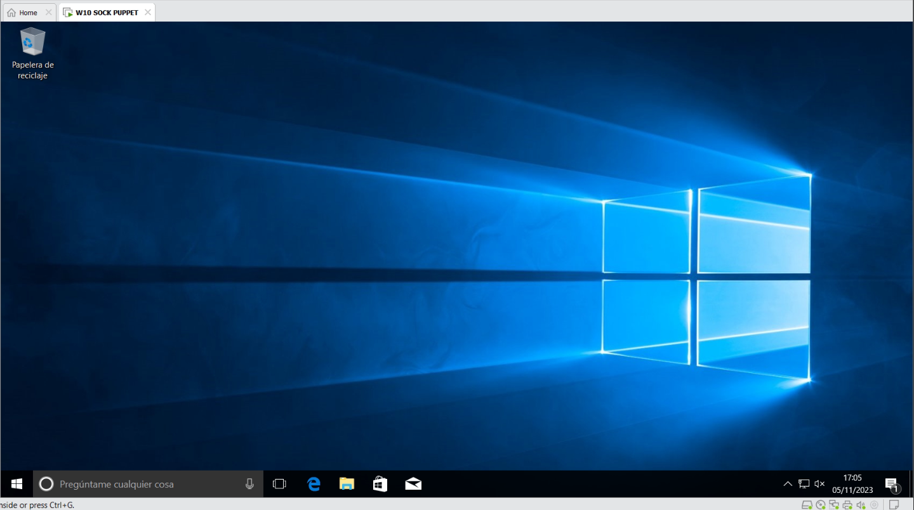

# SOCK PUPPET - DAVID VILA DÍAZ

En las redes sociales y foros existe este término bastante usado de "sock puppet" el cual se refiere a una identidad falsa creada en línea, generalmente usada para engañar, manipular o influenciar las percepciones o discusiones en línea. Estas son en parte, maneras de las que utiliza sock puppet:

- **Autopromoción:** Un autor puede crear una cuenta falsa para elogiar su propio trabajo y dar la impresión de que tiene más apoyo o admiradores de lo que realmente tiene.
- **Manipulación**: Una persona puede usar múltiples identidades en línea para influir en la opinión pública, reforzar un punto de vista o atacar a un oponente.
- **Evasión de bloqueos/”baneos”**: Si alguien es bloqueado o prohibido en un foro o plataforma en línea debido a un comportamiento no deseado, puede crear una cuenta de sock puppet para regresar y continuar participando.
- **Molestar**: Algunas personas crean sock puppets simplemente para molestar o provocar a otros en línea sin que su identidad principal sea responsable.

Estos serán los pasos seguidos para realizar un sock puppet desde cero:

1. **Creación de máquina virtual:**
    
    Se ha creado una máquina con Windows 10 Pro instalándola sin interfaz bridged para que tenga conexión directa con la interfaz de mi ordenador personal. 
    
    
    
    He decidido optar por iTopVPN, porque no requiere de registros para pruebas gratuitas, y lo que queremos conseguir en este proceso es no dejar ni un rastro de mi rastro incluso al registrarme en la página de la VPN y demás del sock puppet que posteriormente voy a crear.
    
    
    
    Aquí se aprecia que la VPN está funcionando.
    
    
    
2. **Creación del Sock Puppet:**
    
    Es en este momento donde las páginas de creación de perfiles falsos toma acción, y por ellos utilizaremos la herramienta [Fake Name Generator](https://www.fakenamegenerator.com/), el cual nos servirá para no solo crear el nombre, apellidos y dirección del sujeto falso, sino de su correo, usuario, contraseña… Dispone de un sistema el cual aparece en la captura que se llama [Fake Mail Generator](https://www.fakemailgenerator.com/) que tiene como función activar el correo del perfil falso recientemente creado para poder tener bandeja de entrada real.
    
    Este será el perfil del usuario que hemos generado: 
    
    
    
    He visualizado la información esencial, pero más abajo se encuentran varias líneas más de descripción. También utilizaré otra herramienta llamada [thispersondoesnotexist.com](https://thispersondoesnotexist.com/), la cual generará una imagen irreal de una persona que servirá como foto de perfil para la red social posterior:
    
    
    
    1. **Actividad en Internet**
    
    Ahora es momento de registrarse en Twitter (X) (en mi caso) para empezar con “el primer contacto al exterior” de nuestro sock puppet. Con ayuda de Fake Mail Generator podremos crear el perfil al completo.
    
    
    
    Hemos conseguido acceder con nuestros datos sin problema, ahora vamos a finiquitar el perfil con la imagen y una buena descripción para que no se dude de este. Ha quedado de la siguiente manera:
    
    
    
    Para dejar la huella de este perfil en la red y pasar desapercibido, he retwiteado un par de cosas y respondido un tweet, al mismo tiempo que también he twitteado algo a nivel personal, pero de manera ficticia.
    
    
    
    A partir de aquí se podrían realizar muchas más acciones.